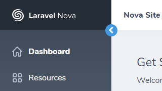
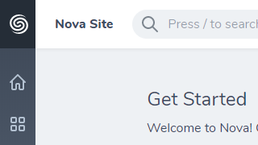

# Laravel Nova Collapsible Sidebar


## About

This is a collapsible sidebar for Laravel Nova 2.

## Installation

To install the sidebar run the following command in your Laravel Nova project:

```bash
composer require pos-lifestyle/laravel-nova-collapsible-sidebar
```

## Usage

Copy the Laravel Nova layout template `vendor/laravel/nova/resources/views/layout.blade.php` to
`resources/views/vendor/nova/layout.blade.php`.

```bash
mkdir -p resources/views/vendor/nova
cp -r vendor/laravel/nova/resources/views/layout.blade.php resources/views/vendor/nova/layout.blade.php
```

In `resources/views/vendor/nova/layout.blade.php` you will find the sidebar which looks like this:

```html
<!-- Sidebar -->
<div class="min-h-screen flex-none pt-header min-h-screen w-sidebar bg-grad-sidebar px-6">
    <a href="{{ \Laravel\Nova\Nova::path() }}">
        <div class="absolute pin-t pin-l pin-r bg-logo flex items-center w-sidebar h-header px-6 text-white">
           @include('nova::partials.logo')
        </div>
    </a>

    @foreach (\Laravel\Nova\Nova::availableTools(request()) as $tool)
        {!! $tool->renderNavigation() !!}
    @endforeach
</div>
```

Replace the ordinary `div` tag by `collapsible-sidebar`:

```html
<collapsible-sidebar class="min-h-screen flex-none pt-header min-h-screen w-sidebar bg-grad-sidebar px-6">
    ...
</collapsible-sidebar>
```

Now you can toggle the sidebar by clicking the icon on the top right of the sidebar. The sidebar automatically expands
when you move the mouse pointer over the sidebar.

## Configuration

To save the state, add `persist` to the `collapsible-sidebar` tag.

```html
<collapsible-sidebar class="..." persist>
    ...
</collapsible-sidebar>
```

To show the trigger only when you move the mouse pointer over the sidebar, add `shy-trigger` to the
`collapsible-sidebar` tag.

```html
<collapsible-sidebar class="..." shy-trigger>
    ...
</collapsible-sidebar>
```

## Screenshots

<table>
    <tr>
        <td><strong>Expanded</strong></td>
        <td><strong>Collapsed</strong></td>
    </tr>
    <tr>
        <td></td>
        <td></td>
    </tr>
</table>
